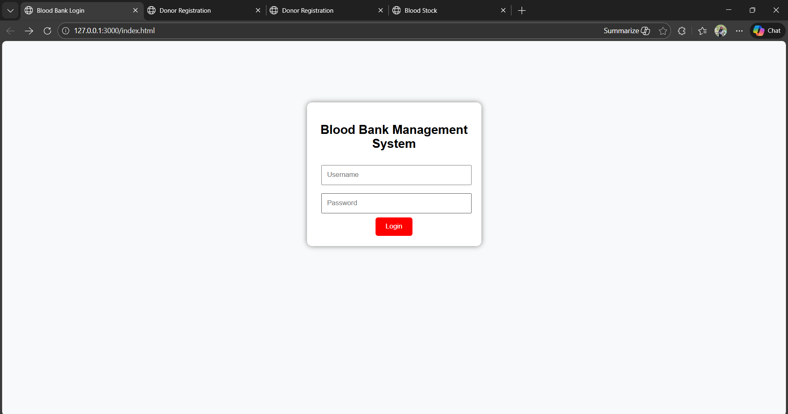
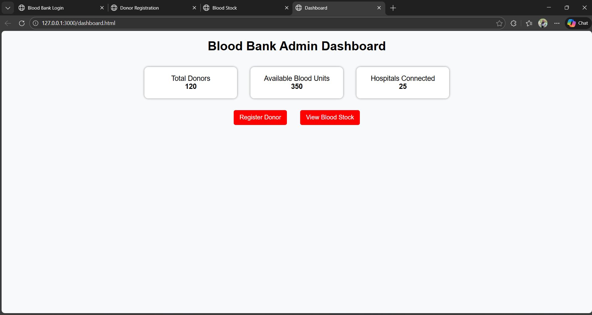
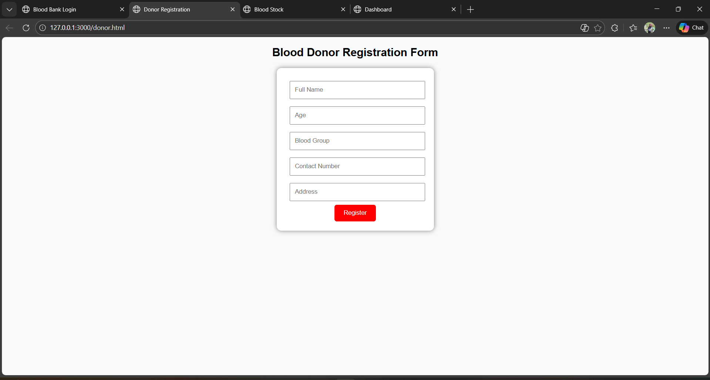
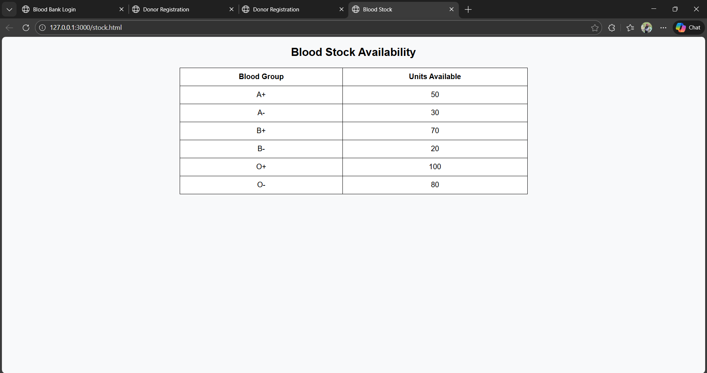

# Blood Bank and Donation Management System Web Interface

This project implements the web interface design based on the research paper:

"Blood Bank and Donation Management System"

The system provides pages for login, donor registration, blood stock monitoring, and admin dashboard.  
This project is developed using HTML and CSS for academic purposes.

Student Name: Unnati Vihirkar.        
Roll no : C-224 & DWP-77

Domain: Healthcare Information System

## Screenshots

### Login Page

### Dashboard Page

### Donor Page

### Blood Stock Page

